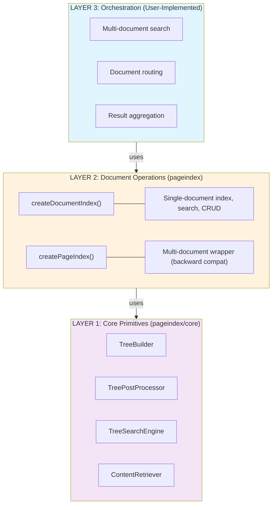
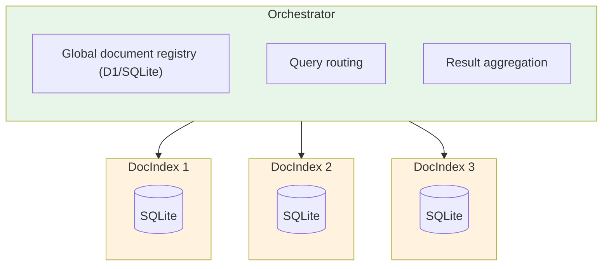

# PageIndex

A reasoning-based RAG (Retrieval-Augmented Generation) library that uses hierarchical tree indexing instead of vector databases. PageIndex enables LLMs to navigate documents through reasoning, mimicking how human experts find information in complex documents.

## Why PageIndex?

Traditional RAG systems rely on vector similarity search, which often fails for professional documents requiring domain expertise. **Similarity ≠ Relevance**.

PageIndex takes a different approach:

1. **Build a hierarchical tree** - Transform documents into a structured "table of contents"
2. **Reason through the tree** - Use LLM reasoning to navigate to relevant sections
3. **Retrieve with context** - Return content with full structural awareness

This mirrors how experts work: understand the document structure first, then reason about where specific information is located.

## Installation

```bash
bun add pageindex
# or
npm install pageindex
```

You'll also need an AI SDK provider:

```bash
bun add @ai-sdk/openai
# or @ai-sdk/anthropic, @ai-sdk/google, etc.
```

---

## Architecture Overview

PageIndex is built in **three layers**, allowing you to use as much or as little abstraction as needed:



### When to Use Each Layer

| Use Case                            | Recommended API                               |
| ----------------------------------- | --------------------------------------------- |
| Quick prototyping, single documents | `createDocumentIndex()`                       |
| Multi-document search (simple)      | `createPageIndex()`                           |
| Cloudflare Durable Objects          | `createDocumentIndex()` + custom orchestrator |
| Custom search pipelines             | Layer 1 primitives                            |

---

## Quick Start: Single Document Index

For most use cases, `createDocumentIndex()` is all you need. It provides a clean API for indexing and searching a single document.

```typescript
import { createDocumentIndex, createSQLiteStorage } from "pageindex";
import { openai } from "@ai-sdk/openai";

// Create storage (SQLite for local dev)
const storage = createSQLiteStorage(":memory:");
storage.initialize();

// Create a document index
const docIndex = createDocumentIndex({
	model: openai("gpt-4o"),
	storage,
});

// Index a markdown document
const { document, stats } = await docIndex.index({
	name: "technical-spec",
	type: "markdown",
	content: `
# API Documentation

## Authentication
Users authenticate using OAuth 2.0 with JWT tokens.
Rate limits: 100 requests/minute for standard users.

## Endpoints
### GET /users
Returns a list of users...

### POST /users
Creates a new user...
  `,
});

console.log(
	`Indexed: ${document.name} (${stats.pageCount} pages, ${stats.tokenCount} tokens)`,
);

// Search using LLM reasoning
const results = await docIndex.search("What are the rate limits?");

for (const result of results) {
	console.log(`[${result.score.toFixed(2)}] ${result.node.title}`);
	console.log(`  Reasoning: ${result.reasoning}`);
	console.log(`  Content: ${result.node.text?.substring(0, 100)}...`);
}

// Get document summary (useful for orchestrators)
const summary = await docIndex.getSummary();
console.log(summary);
// {
//   id: 'technical-spec-m4x7k2-abc123',
//   name: 'technical-spec',
//   description: 'API documentation covering authentication and endpoints...',
//   pageCount: 4,
//   topLevelNodes: [{ nodeId: '0000', title: 'API Documentation', summary: '...' }]
// }

// Cleanup
storage.close();
```

### DocumentIndex API

```typescript
interface DocumentIndex {
	// Current document ID (null if not indexed yet)
	readonly documentId: string | null;

	// Index a document (creates or replaces)
	index(document: DocumentInput): Promise<IndexResult>;

	// Search within this document
	search(query: string, options?: SearchOptions): Promise<SearchResult[]>;

	// Get indexed document metadata
	getDocument(): Promise<IndexedDocument | null>;

	// Get tree structure
	getTree(): Promise<TreeNode[] | null>;

	// Get page content by range
	getContent(startIndex: number, endIndex: number): Promise<string>;

	// Get summary for orchestrators
	getSummary(): Promise<DocumentSummary | null>;

	// Check if document is indexed
	isIndexed(): Promise<boolean>;

	// Delete document from storage
	clear(): Promise<void>;
}
```

---

## Multi-Document with Orchestrator

For production systems with multiple documents, you'll want to implement an **orchestrator** that:

- Maintains a global index of all documents
- Routes search queries to relevant documents
- Aggregates and ranks results

This pattern is especially powerful with **Cloudflare Durable Objects**, where each document gets its own isolated storage and compute.

### Architecture



### Example: Simple Multi-Document Orchestrator

```typescript
import { createDocumentIndex, createSQLiteStorage } from "pageindex";
import type { DocumentIndex, DocumentSummary, SearchResult } from "pageindex";
import { openai } from "@ai-sdk/openai";

interface DocumentRegistry {
	id: string;
	name: string;
	collection: string;
	summary: DocumentSummary;
	index: DocumentIndex;
}

class DocumentOrchestrator {
	private documents = new Map<string, DocumentRegistry>();
	private model = openai("gpt-4o");

	/**
	 * Index a new document
	 */
	async indexDocument(
		name: string,
		content: string,
		type: "markdown" | "pdf",
		collection = "default",
	): Promise<string> {
		// Each document gets its own storage (could be separate SQLite files or DOs)
		const storage = createSQLiteStorage(":memory:");
		storage.initialize();

		const docIndex = createDocumentIndex({
			model: this.model,
			storage,
			processing: {
				addNodeSummary: true,
				addDocDescription: true,
			},
		});

		const result = await docIndex.index({ name, type, content });
		const summary = await docIndex.getSummary();

		if (!summary) throw new Error("Failed to get document summary");

		this.documents.set(summary.id, {
			id: summary.id,
			name,
			collection,
			summary,
			index: docIndex,
		});

		console.log(`Indexed "${name}" with ${summary.pageCount} pages`);
		return summary.id;
	}

	/**
	 * Search across all documents in a collection
	 */
	async search(
		query: string,
		options: {
			collection?: string;
			maxDocuments?: number;
			maxResults?: number;
		} = {},
	): Promise<
		Array<SearchResult & { documentId: string; documentName: string }>
	> {
		const {
			collection = "default",
			maxDocuments = 10,
			maxResults = 5,
		} = options;

		// Filter documents by collection
		const docs = Array.from(this.documents.values())
			.filter((d) => d.collection === collection)
			.slice(0, maxDocuments);

		if (docs.length === 0) {
			return [];
		}

		// Search all documents in parallel
		const searchResults = await Promise.all(
			docs.map(async (doc) => {
				try {
					const results = await doc.index.search(query, { maxResults: 3 });
					return results.map((r) => ({
						...r,
						documentId: doc.id,
						documentName: doc.name,
					}));
				} catch (error) {
					console.error(`Search failed for ${doc.name}:`, error);
					return [];
				}
			}),
		);

		// Merge, sort by score, and return top results
		return searchResults
			.flat()
			.sort((a, b) => b.score - a.score)
			.slice(0, maxResults);
	}

	/**
	 * Search a specific document
	 */
	async searchDocument(
		documentId: string,
		query: string,
		options?: { maxResults?: number },
	): Promise<SearchResult[]> {
		const doc = this.documents.get(documentId);
		if (!doc) throw new Error(`Document ${documentId} not found`);
		return doc.index.search(query, options);
	}

	/**
	 * List all documents
	 */
	listDocuments(collection?: string): DocumentSummary[] {
		return Array.from(this.documents.values())
			.filter((d) => !collection || d.collection === collection)
			.map((d) => d.summary);
	}

	/**
	 * Delete a document
	 */
	async deleteDocument(documentId: string): Promise<void> {
		const doc = this.documents.get(documentId);
		if (doc) {
			await doc.index.clear();
			this.documents.delete(documentId);
		}
	}
}

// Usage
const orchestrator = new DocumentOrchestrator();

// Index multiple documents
await orchestrator.indexDocument(
	"api-docs",
	apiDocsMarkdown,
	"markdown",
	"documentation",
);

await orchestrator.indexDocument(
	"user-guide",
	userGuideMarkdown,
	"markdown",
	"documentation",
);

await orchestrator.indexDocument(
	"quarterly-report",
	quarterlyReportMarkdown,
	"markdown",
	"finance",
);

// Search across documentation
const results = await orchestrator.search("How do I authenticate?", {
	collection: "documentation",
	maxResults: 5,
});

for (const result of results) {
	console.log(
		`[${result.score.toFixed(2)}] ${result.documentName} > ${result.node.title}`,
	);
}
```

### Cloudflare Durable Objects Example

For production deployments, each document can be its own Durable Object with isolated SQLite storage. See [examples/cloudflare-do/](./examples/cloudflare-do/) for a complete implementation including:

- `document-do.ts` - Durable Object wrapping `createDocumentIndex()`
- `orchestrator.ts` - Orchestration logic with D1 global index
- `router.ts` - Hono API routes
- `wrangler.toml` - Cloudflare configuration

```typescript
// Document Durable Object (simplified)
import { DurableObject } from "cloudflare:workers";
import { createDocumentIndex, createDOStorage } from "pageindex";
import { openai } from "@ai-sdk/openai";

export class DocumentDO extends DurableObject {
	private docIndex: DocumentIndex | null = null;

	private getDocIndex(): DocumentIndex {
		if (!this.docIndex) {
			this.docIndex = createDocumentIndex({
				model: openai("gpt-4o", { apiKey: this.env.OPENAI_API_KEY }),
				storage: createDOStorage(this.ctx.storage.sql),
				documentId: this.ctx.id.toString(),
			});
		}
		return this.docIndex;
	}

	async index(document: DocumentInput): Promise<IndexResult> {
		return this.getDocIndex().index(document);
	}

	async search(
		query: string,
		options?: SearchOptions,
	): Promise<SearchResult[]> {
		return this.getDocIndex().search(query, options);
	}

	async getSummary(): Promise<DocumentSummary | null> {
		return this.getDocIndex().getSummary();
	}
}
```

---

## Configuration

### Processing Options

```typescript
const docIndex = createDocumentIndex({
	model: openai("gpt-4o"),
	storage: createSQLiteStorage(":memory:"),

	processing: {
		// PDF: Pages to scan for TOC detection
		tocCheckPages: 20,

		// Maximum tokens per tree node
		maxTokensPerNode: 20000,

		// Add unique IDs to nodes (0000, 0001, etc.)
		addNodeId: true,

		// Generate AI summaries for nodes (improves search quality)
		addNodeSummary: true,

		// Generate document-level description
		addDocDescription: true,

		// Minimum tokens to generate a summary
		summaryTokenThreshold: 200,

		// Content storage strategy:
		// 'inline' - Store text in tree nodes (fast, more memory)
		// 'separate' - Store text separately (slower, less memory)
		// 'auto' - Choose based on document size (default)
		contentStorage: "auto",

		// Page threshold for 'auto' mode
		autoStoragePageThreshold: 50,
	},

	search: {
		maxResults: 5,
		minScore: 0.5,
		maxDepth: Infinity,

		// Domain knowledge to guide search
		expertKnowledge: "For API docs, authentication is usually in Section 2",

		// Context about the document type
		documentContext: "This is a REST API specification",
	},
});
```

### Storage Drivers

PageIndex uses SQL-based storage for full-featured document retrieval including reference following.

#### SQLite (Local Development)

```typescript
import { createSQLiteStorage } from "pageindex";

// In-memory (testing)
const storage = createSQLiteStorage(":memory:");
storage.initialize();

// File-based (persistent)
const storage = createSQLiteStorage("./data/pageindex.db");
storage.initialize();

// Always close when done
storage.close();
```

#### Cloudflare D1 (Workers)

```typescript
import { createD1Storage } from "pageindex";

export default {
	async fetch(request, env) {
		const storage = createD1Storage(env.DB);
		await storage.initialize(); // Run once

		const docIndex = createDocumentIndex({
			model: openai("gpt-4o"),
			storage,
		});
		// ...
	},
};
```

#### Cloudflare Durable Objects SQL

```typescript
import { createDOStorage } from "pageindex";

export class DocumentDO extends DurableObject {
	getStorage() {
		// Uses the DO's built-in SQLite
		return createDOStorage(this.ctx.storage.sql);
	}
}
```

---

## Layer 1: Core Primitives

For advanced use cases, you can use the stateless primitives directly:

```typescript
import {
	TreeBuilder,
	TreePostProcessor,
	TreeSearchEngine,
	ContentRetriever,
	createTreeBuilder,
	createPostProcessor,
	createSearchEngine,
	createRetriever,
} from "pageindex/core";

// Build tree from document (no storage)
const builder = createTreeBuilder(model, { addNodeId: true });
const { tree, pages, stats } = await builder.build({
	name: "doc",
	type: "markdown",
	content: markdownContent,
});

// Add summaries (no storage)
const processor = createPostProcessor(model, { addNodeSummary: true });
const { tree: processedTree, description } = await processor.process(
	tree,
	pages,
);

// Search tree (no storage)
const searchEngine = createSearchEngine(model);
const results = await searchEngine.search("authentication", processedTree, {
	maxResults: 5,
});
```

### Tree Navigation Utilities

```typescript
import {
	getAllNodes,
	getLeafNodes,
	findNodeById,
	getNodePath,
	traverseTree,
	isLeafNode,
	getNodeDepth,
	findNodesByTitle,
} from "pageindex/core";

// Flatten tree
const allNodes = getAllNodes(tree);

// Find specific node
const node = findNodeById(tree, "0005");
const path = getNodePath(tree, "0005"); // ['0000', '0002', '0005']

// Custom traversal
traverseTree(tree, (node, depth) => {
	console.log(`${"  ".repeat(depth)}${node.title}`);
});
```

### Token Utilities

```typescript
import { countTokens, truncateToTokens, splitIntoChunks } from "pageindex";

const tokens = countTokens("Hello, world!");
const truncated = truncateToTokens(longText, 1000);
const chunks = splitIntoChunks(veryLongText, 4000);
```

---

## Backward Compatibility

The original `createPageIndex()` API is still available for multi-document use cases:

```typescript
import { createPageIndex, createSQLiteStorage } from "pageindex";

const storage = createSQLiteStorage(":memory:");
storage.initialize();

const pageIndex = createPageIndex({
	model: openai("gpt-4o"),
	storage,
});

// Index multiple documents
await pageIndex.index({ name: "doc1", type: "markdown", content: "..." });
await pageIndex.index({ name: "doc2", type: "markdown", content: "..." });

// Search across all documents
const results = await pageIndex.search("query");

// List all documents
const docs = await pageIndex.listDocuments();
```

---

## Environment Compatibility

| Environment                | Storage | Notes                         |
| -------------------------- | ------- | ----------------------------- |
| Node.js                    | SQLite  | Full support                  |
| Bun                        | SQLite  | Full support                  |
| Cloudflare Workers         | D1      | Full support                  |
| Cloudflare Durable Objects | DO SQL  | Full support, isolated per DO |

---

## Development

```bash
# Install dependencies
bun install

# Run tests
bun test

# Type check
bun run typecheck

# Build
bun run build
```

---

## License

MIT

## Credits

This is a TypeScript port of [PageIndex](https://github.com/EvidenceRAG/PageIndex), originally implemented in Python.
